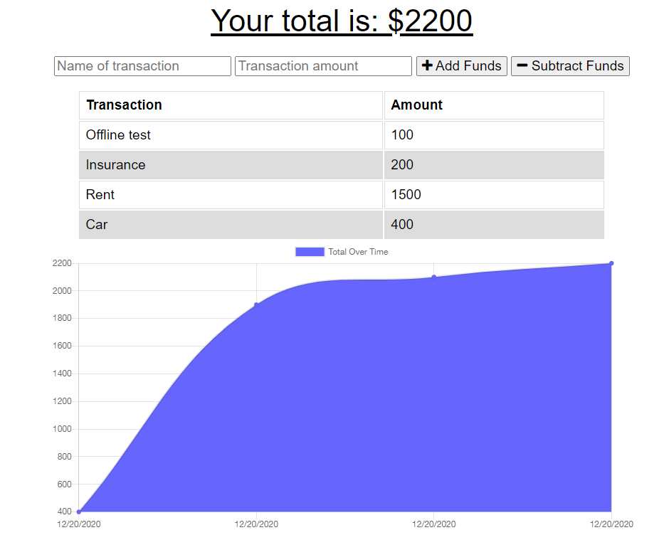

# Budget-Tracker-PWA-

### License:
  

## Description 
A budget tracker application to track your withdrawals and deposits with or without a data/internet connection
so that your account balance is accurate at all times.

## Installation
* clone the application repo: "https://github.com/johngeorge88/Budget-Tracker-PWA-"
* Run (npm install) to install all the dependencies.
* Then run npm start to start the server.

## Usage
You can use the application from this below link: <a href="https://guarded-badlands-83297.herokuapp.com/">Budget Tracker</a>

## Screen-shot:
